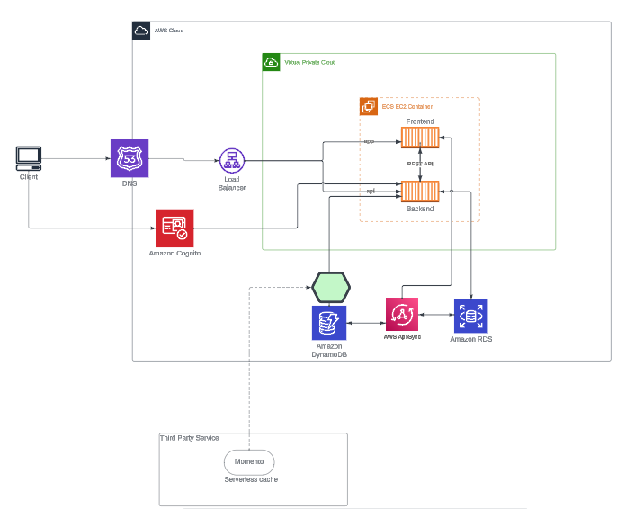

# Week 0 — Billing and Architecture

## Install AWS CLI and ensure it works.

Currently i'm working on ubuntu and going to install AWS CLI on ubuntu using terminal.
- Installed awscli using
```sh
  apt install awscli
```


- Configuring AWS Credentials and Access keys
 ```
  aws configure
 ```
 
- Checking AWS Configured credentials
```
  aws configure list
```
  
- checking aws caller identity
 ``` 
  aws sts get-caller-identity
 ```

### Create a Budget
- Created a zero Doller billing Alarm
- Created a monthly Budget alarm of 10$
  
### Recreate Logical Architecture




  

  

  
